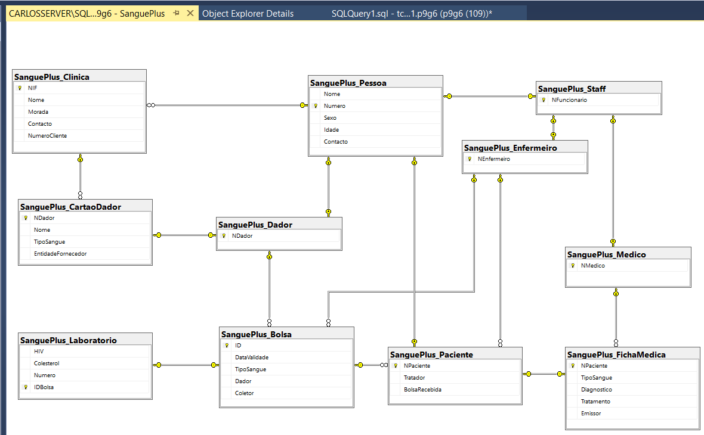

## Projeto de Base de Dados

## Intro
O projeto por nós desenolvido foi um sistema para uma clinica no âmbito da disciplina de Base de Dados.

Essa plataforma permitirá que a clinica consiga registar
pessoas e criar as suas fichas medicas e cartões dador
caso seja necessário, registar resultados nas bolsas de
sangue recolhidas e também a atualização das fichas
associadas a um paciente por parte de um médico. O
objetivo principal do desenvolvimento deste software é
aplicar, de forma abrangente, os conhecimentos teóricos
e práticos adquiridos durante as aulas, desde a
concepção e modelagem de base de dados até a sua
gestão e manipulaçãopor meio de sistemas de software.
 

## Modificações desde a apresentação
Após a apresentacao da aula prática, algumas mudanças foram feitas depois de ouvir a opinião do professor. Introduzimos uma encriptação simples pois recorremos a uso de credenciais na parte da alteração das fichas médicas, algo que antes não tinha sido implementada devido a falta de tempo.
Também foi feito um UDF para ver em que datas existem as bolsas recolhidas evitando assim uma procura extensiva por datas onde poderiam estar (a implementação da UDF deve-se a um erro na parte da interface pois a data do proprio dia já esta presente por pré-definição na interface gráfica, algo que fará com que nenhuma bolsa apareça)
 

## Entregaveis
Tables 
Inserts 
Procedures 
Triggers 
UDF 
Views 

## O que não está na interface
Os views que foram feitos na base de dados não foram implementados na interface devido à falta de necessidade, foram feitos de modo a testar alguns aspetos porém por decisão conjunta decidimos não os introduzir na interface pois não se enquadravam.  
Estes tratam-se de:  
- **VisaoBolsasTestadas**: Mostra a informação das bolsas testadas sem o numero associado pois é algo unico dentro do laboratorio 
- **VisaoLaboratorio**: Mostra a informação das bolsas retirando o NDador e o NEnfermeiro pois são informações que o laboratorio não iria precisar.  
- **VisaoMedicos**: Mostra o numero dos médicos ocultando a password encriptada 

Note-se que os dois primeiros views foram feitos a pensar num layout específico da interface que mais tarde foi feito de outra forma. O ultimo view nao foi usado pois na pesquisa das pessoas global ja aparece o numero do medico e toda a informacao associada a este tirando a password encriptada.

## Notas
Não foi possivel submeter o video devido ao limite de 50Mb pelo elearning, aqui esta um link para aceder: ...  
A submissao com o video incluido foi enviado por email para o professor Joaquim Sousa Pinto (jsp@ua.pt)

| Nmedico | Password |
|---------|----------------|
| M0001   | IamJoseMourinho |
| M0002   | IamDiogoCarvalho |
| M0004   | IamJustATest |
